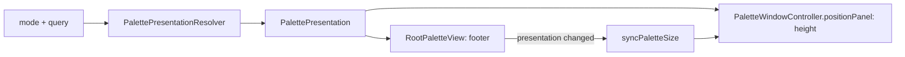

# Palette presentation

Fork-owned. A screen declares how the expanded palette window is presented, so the shell holds no
per-mode special cases.

## Invariants

- `.standard` is today's behaviour: the full window at `panelHeight`, footer shown.
- `.fitted(rows:)` is the bar plus exactly `rows` result rows (at least one, so a hint still fits),
  capped at `panelHeight`. A shown footer adds `bottomBarHeight`.
- A hidden footer removes the bottom bar only; ↵ still runs the screen's primary action.
- The window is top-anchored, so the search bar never moves when the height changes or when the
  compact bar expands (see testing.md, compact swap).
- Compact's collapsed bar ignores presentation; it applies once the window is expanded, in both
  Window mode settings and at every interface size.

## How it flows



## Declaring one

The screen owns the declaration; the resolver (`Tinycast/Fork/Palette/PalettePresentationResolver.swift`)
is the single lookup keyed on mode and query. A fitted screen's rows use
`PalettePresentation.rowHeight(metrics:)` so the window maths and the view agree.

```swift
// On the screen:
static func presentation(for query: String) -> PalettePresentation { .fitted(rows: 1, footer: .hidden) }
// In PalettePresentationResolver.current: route the mode or query to it.
case .myMode: return MyScreen.presentation(for: query)
```

Add a new `Height` or `Footer` case (bar-only, say) in `PalettePresentation` and handle it in
`windowHeight(metrics:)` and `showsFooter`.
